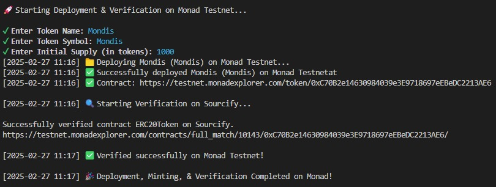

## 🚀 Deploy ERC20 on Monad Testnet 



1. **Install Node.js (Latest LTS Version)**
   - Download from [Node.js Official Site](https://nodejs.org/)
   - Ensure `npm` is installed by running:
     ```sh
     node -v
     npm -v
     ```

2. **Install Git (Optional, but recommended)**
   - Download from [Git for Windows](https://git-scm.com/download/)
   - Verify installation:
     ```sh
     git --version
     ```

3. **Install Hardhat**
   ```sh
   npm install -g hardhat
   ```

4. **Clone the Repository & Install Dependencies**
   ```sh
    git clone https://github.com/PrastianHD/moncontract.git
    cd moncontract
    npm install
    ```

5. **Configure Environment Variables**
   - create .env file and set:
    ```sh
    PRIVATE_KEY=privatekey
    ```

6. **Deploy, Mint & Verify ERC20 Token**
    ```sh
    npm run compile
    npm start
    ```
   - Enter Token Name, Symbol, Supply
   - Wait for deployment, minting, and verification to complete
   - Check contract on Monad Explorer: https://testnet.monadexplorer.com/
